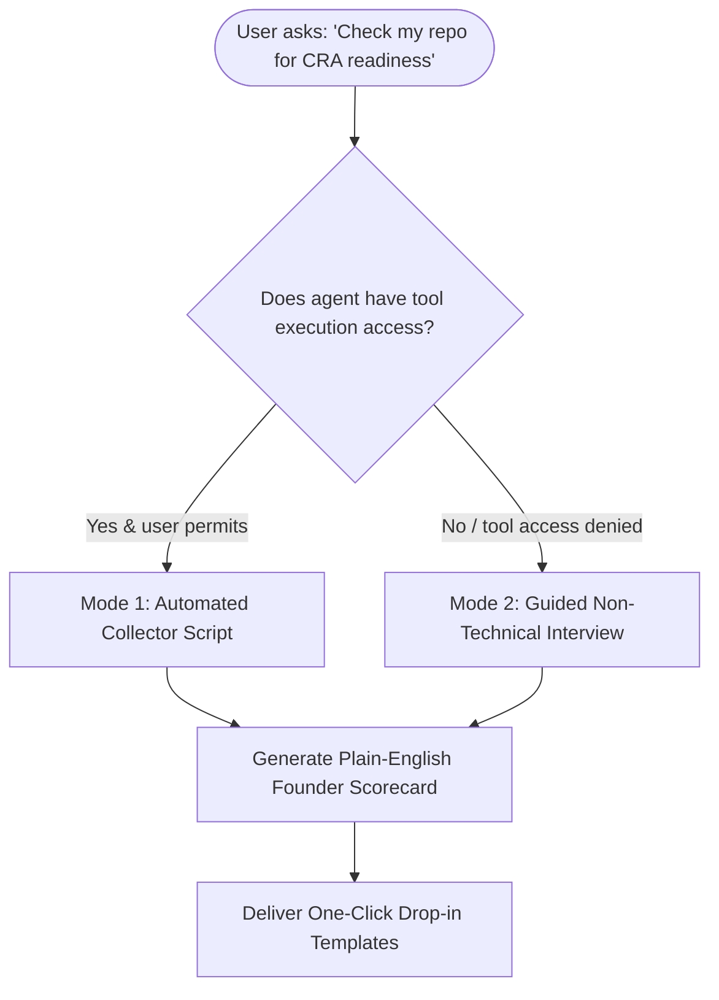

# Cyber Resilience Act (CRA) Readiness Skill

## 1. Overview & Purpose
This skill audits software repositories for compliance with the **EU Cyber Resilience Act (Regulation EU 2024/2847)** from the perspective of **commercial manufacturers and startup founders**.

It translates the official **40-item CRA Manufacturer Compliance Matrix** across all five product lifecycle stages into a clear, actionable letter grade:

| Grade | Status | What It Means for a Startup Founder |
| :---: | :--- | :--- |
| **A** | **Ready for EU Launch** | Both automated CI/CD security controls and required manufacturer policies/documentation are in place. |
| **B** | **Need Automation Work** | Policies and governance exist (`SECURITY.md`, EOL declarations, DoC), but automated CI/CD checks (SBOM generation, automated CVE screening) are missing. |
| **C** | **Need Automation Work & Policy/Document Work** | Common early-stage baseline: missing both CI/CD compliance automation and essential regulatory declarations. |
| **D** | **Incomplete Assessment & Gaps** | Needs both B and C, **and** this skill could not reliably complete the evaluation due to missing tool permissions, lack of repository access, or insufficient product details. |

---

## 2. Operating Modes (Agent-Agnostic)

The skill accommodates different agent environments and user privacy preferences:



### Mode 1: Automated Collector Mode (Preferred when tools available)
If the host agent has terminal/command execution permissions:
1. Run the local collector script:
   ```bash
   python3 scripts/collector.py [path_to_repo] --format json
   ```
2. Parse the JSON result to evaluate the 40 matrix items.
3. If permissions fail or files are unreadable, flag as Grade **D** with the specific permission limitation.

### Mode 2: Guided Conversational Mode (Zero-Tool Access)
If the user prefers not to grant tool/filesystem permissions, the agent conducts a **4-minute founder questionnaire**:
1. **Automation & CI/CD**:
   - *"Do you have an automated GitHub Action or script that generates a machine-readable SBOM (CycloneDX/SPDX JSON) on every build?"*
   - *"Is Dependabot, Renovate, or Snyk enabled to continuously screen dependencies?"*
2. **Vulnerability Disclosure & Article 14 Reporting**:
   - *"Do you have a public `SECURITY.md` with an active security email address?"*
   - *"Does your policy mention notifying authorities/CSIRT within 24 hours of an actively exploited zero-day?"*
3. **Conformity & Support Declarations**:
   - *"Have you declared a minimum support lifetime / End-of-Life date (at least 5 years unless shorter lifetime is justified)?"*
   - *"Is your product classified as Default (Module A internal assessment) with a signed Declaration of Conformity?"*

If the user cannot answer or is unsure about critical architectural items, classify as Grade **D**.

---

## 3. The 40-Item Manufacturer Compliance Matrix

The skill evaluates repositories against the 40 manufacturer obligations (Regulation EU 2024/2847):

<compliance_matrix>
### Stage 1: Company-Level Foundations (4 Items)
- **F.1** (Art. 13(1) · Annex I): Documented Security Development Lifecycle (SDL).
- **F.2** (Annex I · Pt I): Documented evidence of conformity with SDL.
- **F.3** (Annex I · I(2)(3)): SDL explicitly addresses secure-by-design & secure-by-default.
- **F.4** (Art. 19): Written mandate designating an EU Authorised Representative (for non-EU startups).

### Stage 2: Before Development Begins (9 Items)
- **B.1** (Annex III/IV): Determine product classification (Default vs Important Class I/II vs Critical).
- **B.2** (Art. 32 · Annex VIII): Identify conformity assessment route (Module A for Default).
- **B.3** (Annex I · I(1)): Product-specific cybersecurity risk assessment.
- **B.4** (Annex I · I(1)): Documented threat modelling.
- **B.5** (Annex I · Pt II): Third-party and open-source component selection policy.
- **B.6** (Annex I · Pt II): End-of-Life (EOL) check for tools and dependencies.
- **B.7** (Annex I · I(4)(e)): Verification of data-at-rest storage encryption feasibility.
- **B.8** (Annex I · I(2)(b)): Minimal attack-surface architecture (unused ports/services disabled).
- **B.9** (Annex I · I(2)(c)): Zero default credentials policy (no hardcoded passwords).

### Stage 3: During Development (5 Items)
- **D.1** (Annex I · I(1)): Cybersecurity-focused automated test plan.
- **D.2** (Annex I · Pt I): Documented evidence of SDL adherence in builds/PRs.
- **D.3** (Annex I · I(1)): Vulnerability assessment / SAST / DAST screening.
- **D.4** (Annex I · I(2)(f)): Authenticated, integrity-verified software update mechanism.
- **D.5** (Annex I · I(4)(f)): Documented data minimisation policy.

### Stage 4: Before Product Release (12 Items)
- **R.1** (Annex I · II(1)): SBOM prepared and screened for known CVEs.
- **R.2** (Annex I · Pt II): Machine-readable SBOM format (CycloneDX/SPDX JSON).
- **R.3** (Annex I · I(2)(b)): Documented and justified list of inbound connections/ports.
- **R.4** (Annex I · Pt I): Documented and justified list of outbound connections/telemetry.
- **R.5** (Art. 13(8)): Declared product End-of-Life (minimum 5-year support commitment).
- **R.6** (Art. 32): Completed conformity assessment procedure.
- **R.7** (Art. 28 · Annex V): Signed EU Declaration of Conformity (DoC).
- **R.8** (Art. 30): CE marking affixed / packaging placement plan.
- **R.9** (Art. 31 · Annex VII): Compiled Annex VII technical file package.
- **R.10** (Art. 31(3)): 10-year technical file and SBOM retention plan.
- **R.11** (Annex II · Art. 13(18)): User-facing security and configuration instructions.
- **R.12** (Art. 13(5)): Single publicly monitored vulnerability disclosure contact.

### Stage 5: After Product Release (10 Items)
- **A.1** (Annex I · I(1)): Reassessment protocol on significant product changes.
- **A.2** (Art. 14): Continuous automated SBOM vulnerability monitoring (live CVE feeds).
- **A.3** (Art. 14(2)): 24-hour initial vulnerability reporting protocol via ENISA/CSIRT.
- **A.4** (Art. 14(3)): 72-hour detailed technical impact reporting protocol.
- **A.5** (Art. 14(4)): 14-day final remediation reporting protocol.
- **A.6** (Art. 14(2)): Severe incident reporting within 24/72 hours.
- **A.7** (Art. 14(2)(a)): Automated update system for third-party component patches.
- **A.8** (Art. 13(9)): Commitment to provide security updates free of charge.
- **A.9** (Art. 13(8)): 12-month advance notice prior to product End-of-Life.
- **A.10** (Art. 13(14)): Corrective measures, withdrawal, and recall protocol.
</compliance_matrix>

---

## 4. Scoring Rubric & Grade Determination

```text
Is repo inaccessible, permissions denied, or critical info missing?
  YES -> Assign Grade D (Incomplete assessment / Needs B and C)
  NO  ->
    Are both Automation (>=75%) AND Policy/Documentation (>=75%) satisfied?
      YES -> Assign Grade A (Ready for EU Launch)
      NO  ->
        Is Policy/Documentation satisfied (>=60%) but Automation lacking (<75%)?
          YES -> Assign Grade B (Need Automation Work)
          NO  -> Assign Grade C (Need Automation Work and Policy/Document Work)
```

---

## 5. Standard Output Format for Founders

When delivering the scorecard to the founder, format the output as follows:

```markdown
# 🛡️ CRA Manufacturer Readiness Scorecard

**Overall Result**: [🟢 Grade A / 🟡 Grade B / 🟠 Grade C / 🔴 Grade D]  
**Status**: [Ready for EU Launch / Need Automation Work / Need Automation & Policy Work / Incomplete Assessment]

### 📊 Summary Breakdown
- **Technical Automation**: X / 9 items met (SBOM, CI scanning, automated updates)
- **Policies & Technical Documentation**: Y / 31 items met (SDL, disclosures, DoC, EOL)
- **Total Matrix Compliance**: (X+Y) / 40 items

---

### 🚀 Immediate Quick-Win Remediation (Fast Track to Grade A)
1. **[Quick Win 1]**: Drop in `templates/SECURITY.md` (Resolves R.12, A.3-A.6)
2. **[Quick Win 2]**: Drop in `templates/CRA.md` (Resolves B.1-B.2, R.5, R.7, R.10)
3. **[Quick Win 3]**: Add `templates/github-actions/cra-ci-sbom.yml` to `.github/workflows/` (Resolves R.1, R.2, A.2)
```

---

## 6. Packaged Remediation Templates
- [`templates/SECURITY.md`](templates/SECURITY.md): Coordinated vulnerability disclosure policy, security contact email, and Article 14 24h/72h notification statement.
- [`templates/CRA.md`](templates/CRA.md): Manufacturer technical file, Module A classification, 5-year EOL declaration, and 10-year retention statement.
- [`templates/github-actions/cra-ci-sbom.yml`](templates/github-actions/cra-ci-sbom.yml): GitHub Actions CI workflow generating CycloneDX SBOMs and scanning with Trivy.
- [`references/cra_matrix_40.json`](references/cra_matrix_40.json): Full machine-readable matrix definition.
- [`references/scoring_guide.md`](references/scoring_guide.md): Deep-dive scoring and audit guidelines.
