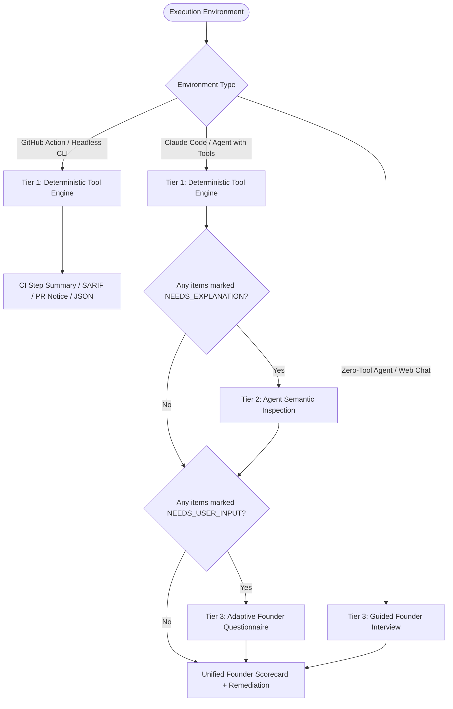

# Cyber Resilience Act (CRA) Readiness Skill

## 1. Overview & Purpose
This skill audits software repositories for compliance with the **EU Cyber Resilience Act (Regulation EU 2024/2847)** from the perspective of **commercial software manufacturers and startup founders**.

It translates the official **40-item CRA Manufacturer Matrix** into a transparent, actionable founder grade:

| Grade | Meaning for Founders | Requirements to Achieve |
| :---: | :--- | :--- |
| **🟢 A** | **Ready for EU Launch** | Both automated CI/CD guardrails and manufacturer governance/policies are established ($\ge 75\%$ each). |
| **🟡 B** | **Need Automation Work** | Policies and legal declarations exist (`SECURITY.md`, `CRA.md`, EOL), but automated CI/CD checks (SBOM generation, CVE screening) are missing. |
| **🟠 C** | **Need Automation & Policy Work** | Typical early-stage baseline: missing both automated CI/CD checks and statutory compliance declarations. |
| **🔴 D** | **Incomplete Assessment / Unassessed** | Repository directory could not be accessed, permission was denied, or the folder is completely empty. |

---

## 2. The 3-Tier Scan Control Architecture

To ensure deterministic reliability in headless CI while providing deep contextual analysis in conversational agents, this skill operates across three distinct tiers:



---

## 3. Agent Execution Instructions

When an agent is asked: *"Evaluate my repository for CRA compliance"* or *"Is my codebase ready for the EU Cyber Resilience Act?"*, execute the following protocol:

### Step 1: Run Deterministic Engine (Tier 1)
If the host agent has terminal/tool execution access:
```bash
python3 scripts/collector.py . --format json
```
Parse the resulting JSON. It categorizes every item into:
- `PASS`: Verified deterministically (workflows, SBOM, lockfiles, Dockerfiles).
- `FAIL`: Required technical pipeline or document absent.
- `NEEDS_EXPLANATION`: Candidate file exists, but requires semantic verification of specific text clauses.
- `NEEDS_USER_INPUT`: Human organizational attestation required.

### Step 2: Semantic Explanation Pass (Tier 2)
For any items flagged as **`NEEDS_EXPLANATION`**:
1. Open the identified `primary_doc` (e.g. `SECURITY.md`, `CRA.md`) using `view_file`.
2. Inspect the content against the `inference_criteria` in [`references/cra_matrix_40.json`](references/cra_matrix_40.json):
   - **R.12 (CVD Contact)**: Verify that a security contact email or private vulnerability reporting link is stated.
   - **A.3–A.6 (Article 14 SLAs)**: Check whether 24-hour early warning, 72-hour assessment, and remediation reporting are specified.
   - **R.5 & A.8 (EOL Support)**: Verify that free security updates are guaranteed for at least 5 years.
   - **B.1, B.2, R.7 (Conformity)**: Verify that product classification and Module A Declaration of Conformity are declared.
3. If the criteria are met, upgrade the item status to **`PASS`**.

### Step 3: Adaptive Founder Interview Pass (Tier 3)
For items flagged as **`NEEDS_USER_INPUT`**:
1. Present the targeted, plain-English questions from [`references/interview_guide.md`](references/interview_guide.md):
   - **F.4**: *"Is your company legally established inside the European Union? If outside the EU, have you appointed an EU Authorised Representative?"*
   - **F.2**: *"Does your team follow a repeatable security process when building features and keep internal records?"*
   - **D.2**: *"Do you enforce peer review and required CI checks before merging into main?"*
2. Record the founder's response:
   - "Yes" $\rightarrow$ `PASS` (record as verified founder attestation).
   - "No / Unsure" $\rightarrow$ `FAIL` (provide drop-in template).

### Step 4: Drop-in Remediation Delivery
For any failing items, provide the immediate one-click solution from `templates/`:
- **For Missing Governance (C $\rightarrow$ B)**:
  - Copy [`templates/CRA.md`](templates/CRA.md) to repository root (Annex VII technical file & Module A DoC).
  - Copy [`templates/SECURITY.md`](templates/SECURITY.md) to repository root (CVD contact & Art. 14 24h notification).
- **For Missing CI Automation (B $\rightarrow$ A)**:
  - Copy [`templates/github-actions/cra-ci-sbom.yml`](templates/github-actions/cra-ci-sbom.yml) to `.github/workflows/cra-ci.yml`.

---

## 4. Zero-Tool Sandbox Mode (Claude Code Desktop / Copilot Chat)

If tool execution is disabled or unavailable:
1. Conduct the **4-minute founder questionnaire** from [`references/interview_guide.md`](references/interview_guide.md).
2. Invite the user to share their `SECURITY.md` or CI workflow snippets.
3. Deliver the Founder Scorecard and point the user to copy the templates.

---

## 5. Headless GitHub Action Mode

Add the audit to your continuous integration pipeline:
```yaml
- name: Run CRA Readiness Audit
  uses: aaronbronow/cra-readiness-skill@v1
  with:
    format: 'markdown'
    fail-on-grade: 'D'
  env:
    GITHUB_TOKEN: ${{ secrets.GITHUB_TOKEN }}
```
The action will write a full Markdown scorecard directly to `$GITHUB_STEP_SUMMARY` and annotate any missing technical requirements on Pull Requests.
