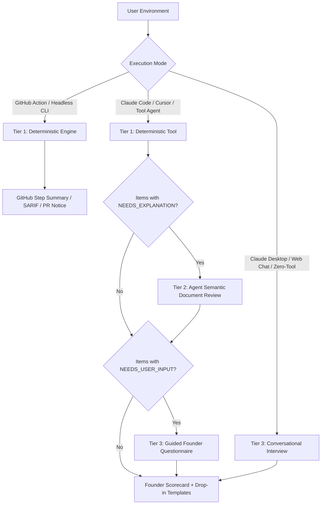

# Developer & Contributor Testing Guide

> **A practical testing runbook for verifying the CRA Readiness Skill across all target user environments, agent frameworks, and permission boundaries.**

---

## 1. Test Strategy & Architecture Overview

The EU Cyber Resilience Act (CRA) Readiness Skill operates across a **3-tier scan control architecture**:



When contributing to or testing this skill, every feature must be verified against **graceful degradation**:
1. **With full tools & token**: Combines deterministic code scans, GitHub API branch protections, agent document comprehension, and founder attestation.
2. **With tools but no token**: Seamlessly skips API calls and falls back to local file signals without throwing errors or non-zero exit codes.
3. **With zero tools (pure chat)**: Conducts the conversational interview using [`references/interview_guide.md`](references/interview_guide.md) without crashing due to missing tool execution.

---

## 2. Permission Matrices

Before running test scenarios, identify the permission levels across three distinct boundaries:

### Matrix A: Agent Runtime Permissions

| Agent Runtime Environment | Bash / Tool Execution | File Read | File Write | Network Access | Expected Operational Flow |
| :--- | :---: | :---: | :---: | :---: | :--- |
| **Claude Code CLI** | ✅ Required | ✅ Required | ✅ Required (Remediation) | ⚠️ Optional (API) | Full 3-tier execution + template drop-in. |
| **Cursor / Windsurf Agent** | ✅ Required | ✅ Required | ✅ Required (Remediation) | ⚠️ Optional (API) | Full 3-tier execution + template drop-in. |
| **VS Code Copilot (Agent mode)** | ✅ Permitted | ✅ Permitted | ✅ Permitted | ⚠️ Optional (API) | Full 3-tier execution. |
| **Claude Desktop (No tools)** | ❌ None | ❌ None | ❌ None | ❌ None | Tier 3 conversational interview only. |
| **GitHub Copilot Chat (Web)** | ❌ None | ❌ None | ❌ None | ❌ None | Tier 3 conversational interview only. |
| **Headless GitHub Action** | ✅ Terminal | ✅ Checkout | ❌ Read-Only | ⚠️ GitHub API | Tier 1 deterministic scan + Step Summary. |

---

### Matrix B: Repository-Level Permissions

| Repository State | Requirements | Handling in Engine |
| :--- | :--- | :--- |
| **Local Working Tree** | Read permissions on `.github/`, root files (`SECURITY.md`, `CRA.md`, `Dockerfile`, `README.md`). | Standard inspection via `Path.glob()` and `Path.read_text()`. |
| **Dirty / Uncommitted Tree** | Uncommitted files are inspected as-is. | Scans current filesystem state without invoking `git diff`. |
| **Shallow Clone (`depth: 1`)** | Single commit history. | Works seamlessly; deterministic checks do not depend on deep git log history. |
| **Bare / Empty Directory** | Directory with 0 files. | Returns **Grade D** with `Repository directory has no files`. |
| **Inaccessible Path** | `chmod 000` or non-existent path. | Returns **Grade D** with graceful error notice; zero unhandled exceptions. |

---

### Matrix C: GitHub Cloud & Token Permissions

The deterministic engine ([`scripts/collector.py`](scripts/collector.py)) can optionally query the GitHub REST API to verify remote configurations (e.g. branch protection, security alerts). 

| Feature Verified | Matrix ID | Fine-Grained PAT Permission | Classic PAT Scope | Default `GITHUB_TOKEN` | Graceful Fallback if Token Absent / Restricted |
| :--- | :---: | :--- | :--- | :--- | :--- |
| **Branch Protection & Rulesets** | `D.2` | `Repository permissions: Administration (Read-only)` | `repo` (private) or `public_repo` | None | Checks for `.github/pull_request_template.md` or flags `NEEDS_USER_INPUT`. |
| **CodeQL & Secret Scanning Alerts** | `D.3` | `Repository permissions: Security events (Read-only)` | `security_events` | `security-events: read` | Scans `.github/workflows/` for CodeQL/Gitleaks/Trivy configs. |
| **Dependabot Alerts / Patching** | `B.6`, `A.2` | `Repository permissions: Dependabot alerts (Read-only)` | `repo` | None | Scans `.github/dependabot.yml` or `renovate.json`. |
| **Private Vulnerability Reporting** | `R.12` | `Repository permissions: Vulnerability alerts (Read-only)` | `repo` | None | Scans `SECURITY.md` for security email / contact points. |

> [!NOTE]
> **Zero Token Requirement**: A GitHub token is **never mandatory**. The engine automatically detects whether `GITHUB_TOKEN` is present. If absent, it logs an informative diagnostic notice and completes the audit using local file signals.

---

## 3. Critical Path Test Runbooks

### 🧪 Runbook 1: Claude Code CLI / Tool-Enabled Agent

This represents the primary developer and maintainer workflow.

#### Setup & Prerequisites:
- Claude Code CLI installed (`npm install -g @anthropic-ai/claude-code`).
- Terminal opened in your target project directory.
- `cra-readiness-skill` repository cloned locally.

#### Test Execution:
1. Launch Claude Code pointing to the skill:
   ```bash
   claude
   ```
2. Enter the test prompt:
   > *"Evaluate this repository against the Cyber Resilience Act using the instructions in SKILL.md."*

#### Expected Agent Behavior:
1. **Tier 1 (Tool Run)**: The agent runs `python3 /path/to/cra-readiness-skill/scripts/collector.py . --format json`.
2. **Tier 2 (Semantic Inspection)**: The agent identifies any items outputting `NEEDS_EXPLANATION` (e.g. `R.12`, `A.3`–`A.6`), reads the project's `SECURITY.md` or `CRA.md`, and validates clauses.
3. **Tier 3 (Targeted Interview)**: The agent asks 2–3 specific questions for remaining `NEEDS_USER_INPUT` items (e.g. EU Authorised Representative mandate).
4. **Remediation**: If items fail, the agent offers to copy `templates/CRA.md` or `templates/SECURITY.md`.

---

### 🧪 Runbook 2: Zero-Tool Sandboxes (Claude Desktop Chat / Web LLMs)

This represents a founder using a restricted chat window or desktop application without filesystem access.

#### Setup & Prerequisites:
- Claude Desktop App, ChatGPT, or GitHub Copilot Chat in web mode (no terminal execution allowed).

#### Test Execution:
1. Copy the content of [`SKILL.md`](SKILL.md) and [`references/interview_guide.md`](references/interview_guide.md) into the prompt context.
2. Prompt the agent:
   > *"I am a startup founder. Can you evaluate my repository readiness for the EU Cyber Resilience Act? I don't have tool access enabled, so please conduct the conversational assessment."*

#### Expected Agent Behavior:
1. The agent immediately initiates the **4-minute founder questionnaire** from [`references/interview_guide.md`](references/interview_guide.md).
2. It asks 4 discrete modules (EU Representative, dependency policy, code review, incident notification).
3. It asks the founder to paste their `SECURITY.md` or describe their CI workflows.
4. It computes a provisional founder grade (**A, B, C, or D**) and outputs drop-in markdown text for missing policies.
5. **Pass Criteria**: The agent never crashes or attempts to execute bash commands.

---

### 🧪 Runbook 3: IDE Coding Agents (Cursor / Windsurf / VS Code Copilot)

This represents a developer working inside an IDE editor.

#### Setup & Prerequisites:
- Cursor IDE, Windsurf, or VS Code with GitHub Copilot Chat in Agent mode.
- Workspace root set to the target repository.

#### Test Execution:
1. Reference `@SKILL.md` in the chat panel:
   > *"@SKILL.md Audit our codebase for CRA readiness and generate any missing remediation files."*

#### Expected Agent Behavior:
1. The agent inspects `.github/workflows/`, `SECURITY.md`, and package manifests.
2. It generates a plain-English scorecard.
3. It creates unified diffs or uses file creation tools to write `.github/workflows/cra-ci.yml` and `CRA.md`.
4. **Pass Criteria**: All generated files adhere to the formats in `templates/`.

---

### 🧪 Runbook 4: Headless GitHub Actions Runner (CI/CD)

This tests the automated CI pipeline using [`action.yml`](action.yml).

#### Test 4A: Local CI Simulation
You can test the GitHub Action runner locally without pushing to GitHub:

```bash
# Create temporary mock CI environment variables
export GITHUB_STEP_SUMMARY=/tmp/step_summary.md
export GITHUB_OUTPUT=/tmp/github_output.txt

# Run the collector in GitHub Action mode
python3 scripts/collector.py . --github-action --format markdown

# Verify Step Summary output
cat /tmp/step_summary.md

# Verify GitHub Action Step Outputs
cat /tmp/github_output.txt
```

**Expected Results**:
- `step_summary.md` contains the full Markdown scorecard table and badge.
- `github_output.txt` contains:
  ```text
  grade=C
  passed_items=17
  automation_met=8
  policy_met=9
  ```
- Terminal outputs GitHub workflow annotations:
  ```text
  ::notice title=CRA Readiness Grade::C - Need automation work and policy/document work...
  ::warning title=Missing CRA Automation::1 CI checks missing
  ```

#### Test 4B: Live GitHub Action Workflow
Add [`templates/github-actions/cra-audit.yml`](templates/github-actions/cra-audit.yml) to your test repository on a feature branch and push. Verify:
1. The job passes or fails based on `fail-on-grade`.
2. The GitHub Action run summary renders the formatted scorecard table in the GitHub web UI.

---

### 🧪 Runbook 5: Standalone Local Terminal CLI (Offline Founder)

This verifies that a founder can run a zero-token audit on any machine with standard Python.

#### Test Execution:
```bash
# 1. Default human-readable Markdown scorecard
python3 scripts/collector.py .

# 2. Fast single-line headline summary
python3 scripts/collector.py . --format summary

# 3. Machine-readable JSON output
python3 scripts/collector.py . --format json

# 4. Fail-on gate check (useful for pre-commit hooks)
python3 scripts/collector.py . --fail-on D
```

**Performance Criteria**:
- Execution completes in **under 50 milliseconds**.
- Memory footprint is negligible (<25MB).
- No external Python packages (`pip`) required.

---

## 4. Automated Test Suite Execution

The repository includes a comprehensive automated test suite verifying all 40 obligations, schema validation, synthetic archetypes, and error handling.

### Running with `unittest` (Zero Dependencies):
```bash
python3 -m unittest discover tests
```

### Running with `pytest`:
```bash
pytest -v tests/test_evaluation_suite.py
```

### Running Comparative Benchmarks across Models:
```bash
python3 scripts/evaluate_implementations.py --save-default-report
```
*Generates an updated comparison report in [`docs/evaluations/implementation_comparison_report.md`](docs/evaluations/implementation_comparison_report.md).*

---

## 5. Troubleshooting & Common Failure Modes

### 1. `403 Forbidden` from GitHub API
- **Symptom**: When running with `--token`, terminal logs an HTTP 403 error.
- **Cause**: The supplied token lacks read permissions for repository administration or security events.
- **Expected Behavior**: The engine logs a graceful fallback notice and continues scanning local files. It must **never** crash or exit with a non-zero code due to an API error.

### 2. Unexpected Grade D Assignment
- **Symptom**: An active repository receives **Grade D**.
- **Cause**: The directory path passed was invalid, permission was denied, or the folder was completely empty.
- **Resolution**: Verify that the path points to the root of the checkout containing code or project manifests.

### 3. Missing `primary_doc` in JSON Matrix
- **Symptom**: `TestSchemaAndCompleteness.test_all_40_items_enriched` fails.
- **Cause**: An entry in [`references/cra_matrix_40.json`](references/cra_matrix_40.json) is missing the `tier`, `primary_doc`, `inference_criteria`, or `interview_prompt` field.
- **Resolution**: Ensure all 40 items define the required 3-tier metadata schema.
