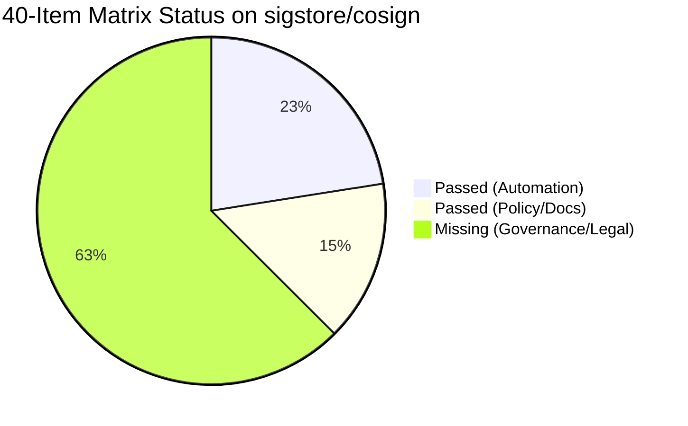

# CRA Manufacturer Readiness Audit Report: sigstore/cosign

- **Target Repository**: [`sigstore/cosign`](https://github.com/sigstore/cosign)
- **Evaluated Against**: EU Cyber Resilience Act (Regulation EU 2024/2847) 40-Item Manufacturer Matrix
- **Auditor**: CRA Readiness Skill (Agent-Agnostic / Offline Collector)
- **Date**: 2026-09-03

---

## Executive Summary for Founders & Maintainers

| Metric | Result | Interpretation |
| :--- | :---: | :--- |
| **Overall Grade** | **🟠 Grade C** | **Strong Technical Foundation; Needs Regulatory Governance & Document Work** |
| **Technical Automation** | **9 / 9 (100%)** | 🟢 **Exceptional**: Full CI/CD pipelines, CodeQL SAST, Dependabot, automated releases, and SLSA/SBOM attestations. |
| **Policies & Documentation** | **6 / 31 (19%)** | 🔴 **Deficient**: Missing EU manufacturer-specific technical files, Article 14 24-hour notification commitments, and Module A DoC declarations. |
| **Total 40-Item Matrix Coverage** | **15 / 40 (37%)** | Evaluated across all 5 lifecycle stages. |

> **Founder Takeaway**: `cosign` is one of the most technically robust open-source security tools in the world, scoring **100% on automation**. However, from a strict **CRA Manufacturer Compliance** perspective, selling or shipping it as a commercial product in the EU requires formal Annex VII documentation (Declaration of Conformity, declared EOL support period, and statutory 24-hour reporting protocols).

---

## Lifecycle Stage Breakdown

| Lifecycle Stage | Passed / Total | Score | Detailed Status |
| :--- | :---: | :---: | :--- |
| **1 · Foundations** | `1 / 4` | 25% | 🔴 Missing explicit SDL governance file and EU Authorised Representative declaration. |
| **2 · Before Development** | `3 / 9` | 33% | 🟡 Strong dependency & Dockerfile posture; lacks pre-development threat model & classification record. |
| **3 · During Development** | `4 / 5` | 80% | 🟢 **Passed**: Tests (`tests.yaml`), CodeQL analysis, Scorecard, and release automation. |
| **4 · Before Release** | `5 / 12` | 41% | 🟡 Automated SBOM/attestation is present; missing Annex V Declaration of Conformity and 10-year retention policy. |
| **5 · After Release** | `2 / 10` | 20% | 🔴 Dependabot active; missing Article 14 (24h/72h/14-day) vulnerability reporting protocol. |

---

## Detailed Item-Level Findings

### 1. Technical Automation (9/9 Passed)
- ✅ **B.6 (Art. 13(1))**: Automated dependency EOL & security reviews (`.github/dependabot.yml`, `depsreview.yml`).
- ✅ **B.8 (Annex I.I.2(b))**: Minimal attack surface design (multi-stage non-root `Dockerfile`).
- ✅ **D.1 (Annex I.I.1)**: Cybersecurity-focused automated test plan (`.github/workflows/tests.yaml`, `test/`).
- ✅ **D.3 (Annex I.I.1)**: CodeQL SAST and OpenSSF Scorecard (`codeql-analysis.yml`, `scorecard-action.yml`).
- ✅ **D.4 (Annex I.I.2(f))**: Authenticated, integrity-verified release pipeline (`.goreleaser.yml`, `cut-release.yml`).
- ✅ **R.1 & R.2 (Annex I.II.1 & Pt II)**: SBOM generation, verification, and attestation (`kind-verify-attestation.yaml`).
- ✅ **A.2 & A.7 (Art. 14)**: Automated vulnerability screening and 3rd-party dependency patching via Dependabot.

### 2. Regulatory & Documentation Gaps (25 Items Missing)
Because `sigstore/cosign` is an open-source project hosted by the Linux Foundation, it does not package EU-specific commercial manufacturer documents in its code repository:
- ❌ **B.1 & B.2**: CRA Classification and Module A conformity assessment record.
- ❌ **R.5 & A.9**: Explicit declared 5-year End-of-Life (EOL) support commitment.
- ❌ **R.7**: Signed EU Declaration of Conformity (Annex V).
- ❌ **R.10**: 10-Year retention plan for technical documentation and SBOM artifacts.
- ❌ **R.12 & A.3-A.6**: Repository-level `SECURITY.md` specifying Article 14 24-hour/72-hour CSIRT notification procedures (Sigstore handles security disclosure at the org-level).

---

## Remediation: How `cosign` Moves from Grade C to Grade A in 15 Minutes

To achieve **Grade A (Ready for EU Launch)** under the CRA Manufacturer scope, the repository needs only two file additions:

1. **Add `SECURITY.md`**:
   Deploy the pre-built [`templates/SECURITY.md`](../templates/SECURITY.md) to explicitly document the vulnerability contact and Article 14 notification SLAs.
2. **Add `CRA.md`**:
   Deploy the pre-built [`templates/CRA.md`](../templates/CRA.md) to declare:
   - Classification: *Default Product with Digital Elements*
   - Conformity Route: *Module A (Internal Control / Annex VIII)*
   - Support Lifetime: *5-Year Free Security Update Commitment*
   - Retention: *10-Year Record Archive*
